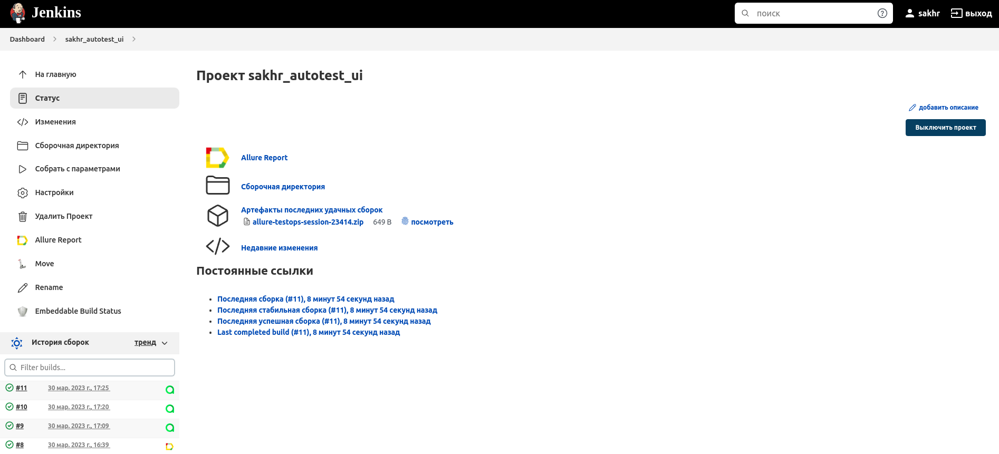
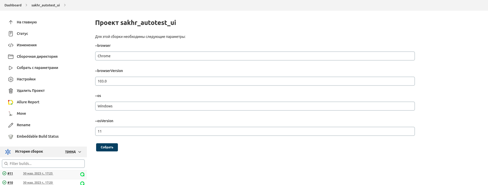
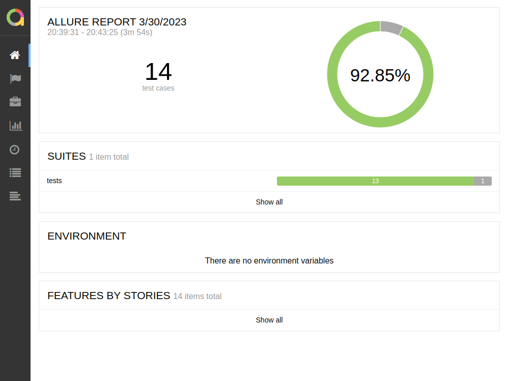
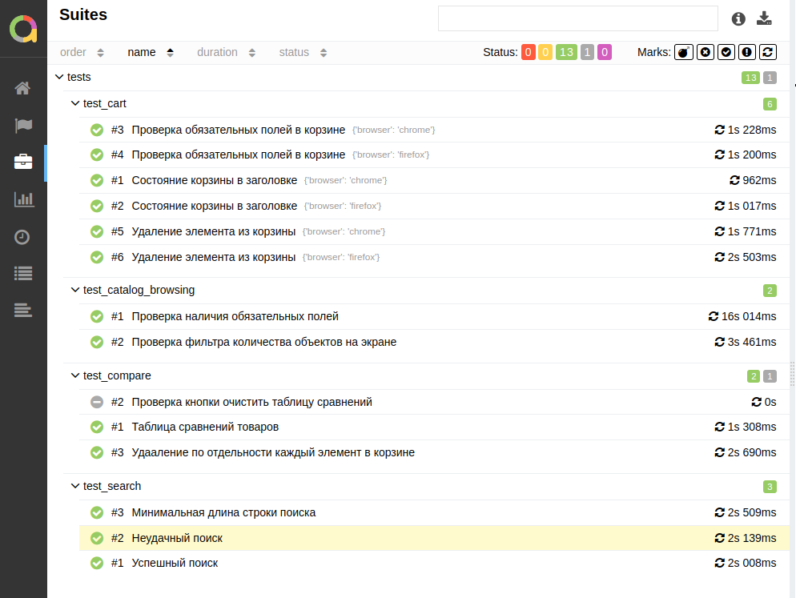
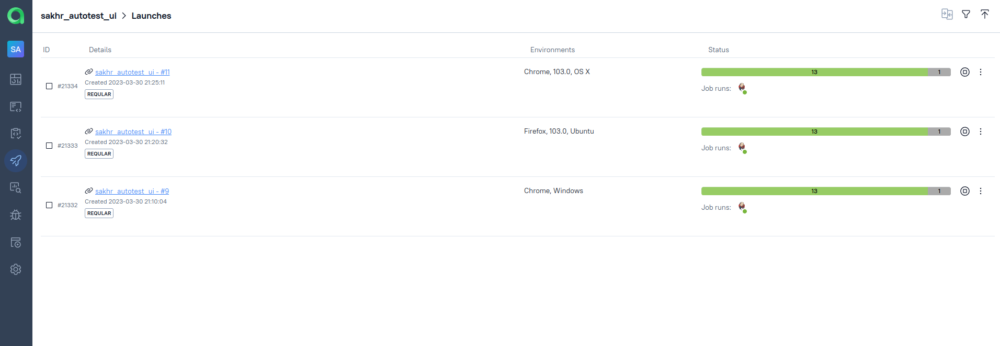
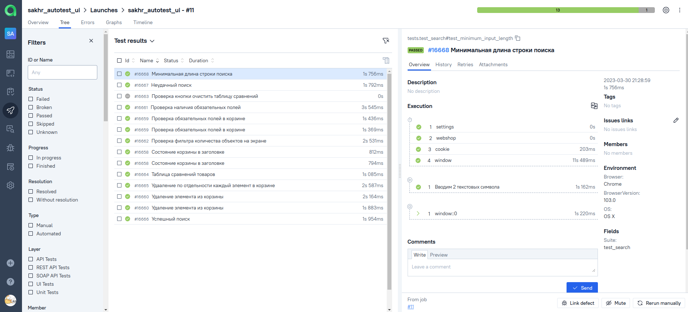
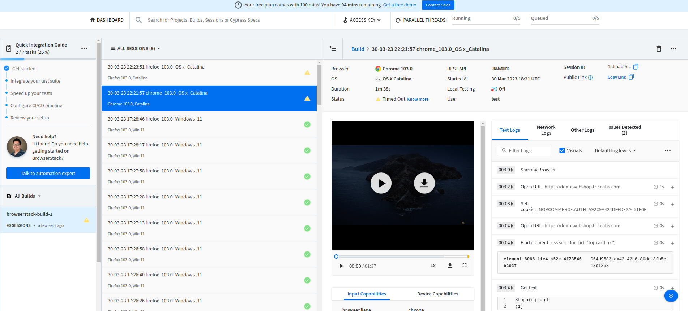
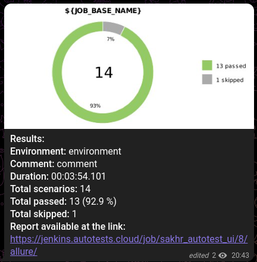

# Проект автотестов на сайт [https://demowebshop.tricentis.com/](https://demowebshop.tricentis.com/)

Проект ui автотестов для https://demowebshop.tricentis.com/.

<a name="оглавление"></a>

# Оглавление

Главное

1. [Технологии](#технологии)
2. [Описание проекта](#описание)
3. [Параметры запуска](#параметры_запуска)

Запуск

4. [Запуск](#запуск)
5. [Запуск при помощи Docker](#запуск_docker)
6. [Запуск при помощи start.sh](#запуск_startsh)
7. [Запуск в Jenkins](#запуск_дженкинс)

Результаты

8. [Результат прохождения тестов](#report)
9. [Пример работы тестов (видео)](#reportVideo)
10. [Результаты тестов в телеграм](#reportTelegram)

<a name="технологии"></a>

# В проекте использовалось:

<p>


</p>

[К оглавлению](#оглавление)

<a name="описание"></a>

# Описание проекта

Автоматизирована проверка сайта https://demowebshop.tricentis.com/.
Тесты написаны на python с использованием pytest+selenium.

[К оглавлению](#оглавление)

<a name="параметры_запуска"></a>

# Параметры запуска

```sh
#Способ работы с основным драйвером
--driver #selenoid #browserstack #local

#Какой браузер будет использоваться в тестах
--browser #chrome #firefox
#Какая версия браузера будет использоваться в тестах
--browserVersion #103

#Какая ОС будет использоваться, параметр применяется только если --driver=browserstack
--os #windows #os x
#Версия ОС
--osVersion #11

#Выполнение тестов без окна браузера,используется совместно с локальным docker
--headless #True #False

#Нужно ли сохранять в аллюр артефакты тестирования скрины, видео
--attachments #True #False
```

<a name="запуск"></a>

# Запуск

```sh
#предварительно выполнить
poetry install

#Вариант запуска 1 - Запуск локально всех тестов 
poetry run pytest tests/ --env=test

#Вариант запуска 1 - Запуск одиночного через browserstack с использованием firefox на OS X
poetry run pytest tests/test_compare.py --env=test --driver=browserstack --browser=firefox --os="OS x" --osVersion=Catalina
```

<a name="запуск_docker"></a>

# Запуск при помощи Docker

```sh
#Для запуска у вас должен быть установлен docker и docker-compose

#Билдим нужные образы
docker-compose -f docker/docker-compose.yml build

#Запускаем python с тестами в docker
#Внутри докера тесты будут запущены командой: poetry run pytest tests/ --env=test --headless=true --attachments=false
#Тесты будут выполнены без окна браузера
docker-compose -f docker/docker-compose.yml up python

#Смотрим результат в Allure
docker-compose -f docker/docker-compose.yml up allure
#Запуск Allure произойдет внутри контейнера docker на стандартном ip и port http://172.18.0.3:35223
Starting allure_test_mobile ... done
Attaching to allure_test_mobile
allure_test_mobile | Generating report to temp directory...
allure_test_mobile | Report successfully generated to /tmp/5220404875736678387/allure-report
allure_test_mobile | Starting web server...
allure_test_mobile | 2023-03-30 22:32:19.545:INFO::main: Logging initialized @1747ms to org.eclipse.jetty.util.log.StdErrLog
allure_test_mobile | Can not open browser because this capability is not supported on your platform. You can use the link below to open the report manually.
allure_test_mobile | Server started at <http://172.18.0.3:35223/>. Press <Ctrl+C> to exit

#после завершения работы Allure удалите папку allure-results
rm -rf allure-results
```

<a name="запуск_startsh"></a>

# Запуск start.sh

```sh
#Запустит тесты и allure через docker
./docker/start.sh
```


<a name="запуск_дженкинс"></a>

# Запуск тестов в [Jenkins](https://jenkins.autotests.cloud/job/sakhr_autotest_ui/8/allure/)

<details>
<summary>Jenkins</summary>
Главная страница сборки

<br/><br/>
Сборка с параметрами

</details>

<a name="report"></a>

# [Отчет](https://jenkins.autotests.cloud/job/sakhr_autotest_ui/8/allure/#) о выполнении тестов

<details>
<summary>AllureReport</summary>
Главная страница сборки

<br/><br/>
Сборка с параметрами

</details>


<details>
<summary>AllureTestOps</summary>
Главная страница сборки

<br/><br/>
Сборка с параметрами

</details>

<details>
<summary>Browserstack</summary>

<br/><br/>
</details>

Каждый тест, независимо от результата, состоит из:

- начальных параметров,
- шагов,
- скриншота браузера,
- исходного кода страницы,
- лога консоли браузера,
- видео выполнения теста.

<a name="reportVideo"></a>

# Пример прохождения теста на удаленной машине


<a name="reportTelegram"></a>

# По результатам работы тестов отправляется краткий отчет в Telegram




